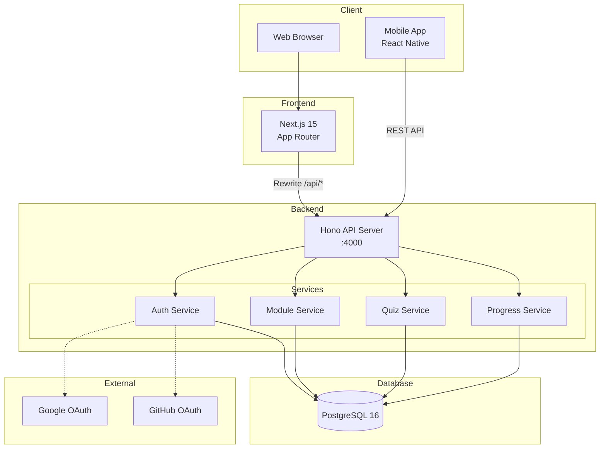

# Learn Claude Code

Claude Codeの使い方をインタラクティブに学べる教育アプリ

An interactive educational app for learning how to use Claude Code.

## Overview

Learn Claude Codeは、開発者（初心者〜中級者）がClaude Codeを業務で活用するためのスキルを、段階的なモジュール・レッスン・クイズを通じて習得できるアプリです。

## Features

- **段階的学習モジュール** - 入門から実践まで体系的に学習
- **インタラクティブクイズ** - 理解度を確認しながら進行
- **進捗トラッキング** - 学習の進み具合を可視化
- **ストリーク管理** - 継続学習のモチベーション維持
- **OAuth ソーシャルログイン** - Google / GitHub 対応

## Tech Stack

### Frontend (Web)
- Next.js 15 (App Router)
- TypeScript
- Tailwind CSS v4
- shadcn/ui
- Redux Toolkit

### Backend
- Hono + Node.js
- Prisma ORM
- PostgreSQL 16
- arctic (OAuth 2.0) + jose (JWT)

### Infrastructure
- pnpm Workspaces + Turborepo
- Docker Compose

## Architecture



## Project Structure

```
claudecode/
├── doc/
│   ├── development/           # 開発計画
│   └── development-process/   # 進捗レポート
└── sys/                       # Monorepo root
    ├── package.json
    ├── pnpm-workspace.yaml
    ├── turbo.json
    ├── docker-compose.yml
    │
    ├── backend/api/           # Hono API
    │   ├── prisma/            # Schema & migrations
    │   └── src/
    │       ├── routes/        # auth, modules, quizzes, progress
    │       ├── services/      # Business logic
    │       ├── middleware/     # JWT auth, error handler
    │       └── lib/           # prisma, jwt, env
    │
    ├── frontend/user/web/     # Next.js 15
    │   └── src/
    │       ├── app/           # App Router pages
    │       ├── components/    # UI components
    │       ├── store/         # Redux Toolkit
    │       └── hooks/         # Custom hooks
    │
    └── packages/
        ├── shared-types/      # Shared type definitions
        ├── zod-schemas/       # API validation schemas
        └── api-client/        # Fetch wrapper
```

## Getting Started

### Prerequisites

- Node.js 22+
- pnpm 9.15+
- Docker & Docker Compose

### Setup

```bash
# Install dependencies
cd sys
pnpm install

# Start PostgreSQL & Adminer
docker compose up -d

# Run database migration
pnpm db:migrate

# Start dev servers (API + Web)
pnpm turbo dev
```

### Environment Variables

```bash
cp sys/.env.example sys/backend/api/.env
# Edit .env with your OAuth credentials
```

### Services

| Service | URL | Description |
|---------|-----|-------------|
| Web Frontend | http://localhost:3000 | Next.js App |
| Backend API | http://localhost:4000 | Hono API Server |
| Adminer | http://localhost:5050 | Database Admin UI |
| PostgreSQL | localhost:5432 | Database |

## License

MIT

## Author

たのしみdev
